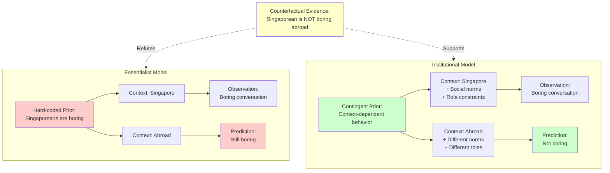

```mermaid
flowchart TB
    subgraph Essentialist["Essentialist Model"]
        E1["Hard-coded Prior:<br/>Singaporeans are boring"]
        E2["Context: Singapore"]
        E3["Observation:<br/>Boring conversation"]
        E4["Context: Abroad"]
        E5["Prediction:<br/>Still boring"]

        E1 --> E2
        E1 --> E4
        E2 --> E3
        E4 --> E5

        style E1 fill:#ffcccc
        style E5 fill:#ffcccc
    end

    subgraph Institutional["Institutional Model"]
        I1["Contingent Prior:<br/>Context-dependent behavior"]
        I2["Context: Singapore<br/>+ Social norms<br/>+ Role constraints"]
        I3["Observation:<br/>Boring conversation"]
        I4["Context: Abroad<br/>+ Different norms<br/>+ Different roles"]
        I5["Prediction:<br/>Not boring"]

        I1 --> I2
        I1 --> I4
        I2 --> I3
        I4 --> I5

        style I1 fill:#ccffcc
        style I5 fill:#ccffcc
    end

    Counterfactual["Counterfactual Evidence:<br/>Singaporean is NOT boring abroad"]

    Counterfactual -.->|Refutes| Essentialist
    Counterfactual -.->|Supports| Institutional

    style Counterfactual fill:#ffffcc
```
